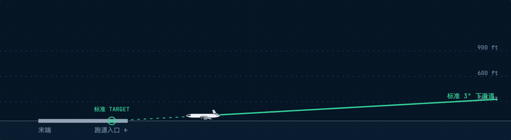
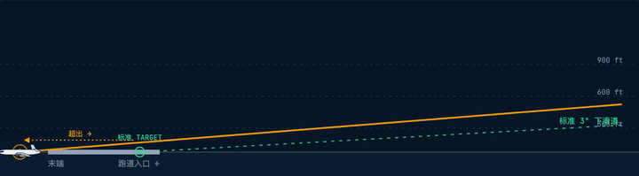
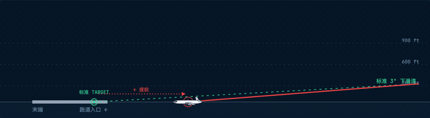

# AgentILS

[English](README.md) · [简体中文](README.zh-CN.md)

> **A**gent **I**nstrument **L**anding **S**ystem —— 借用航空 ILS 隐喻：把 LLM agent 比作飞行员，IDE 是驾驶舱，本仓库是跑道边的"信标系统"，让 agent 的每一次进近都稳定、可观测、可中止。

真实世界的 ILS 给驾驶舱送两束正交的引导信号（航向台 + 下滑台）外加一串 marker 信标，告诉飞行员"你离跑道 X km，在道线上 / 偏出"。AgentILS 给 LLM 驱动真实代码库做的是同一件事：

| 航空 ILS                | AgentILS 对应物                                                          |
| ----------------------- | ------------------------------------------------------------------------ |
| 航向台（横向引导）      | `packages/mcp` orchestrators —— 让 agent 留在计划好的任务航道            |
| 下滑台（垂直引导）      | `packages/quality-gate` ECAM 面板 —— 让每次提交保持在质量斜率上          |
| 远 / 中 / 近 marker     | `request_user_clarification` 等 —— 离散的 "你已抵此点，请确认" 信标      |
| 黑匣子 / 飞行数据记录器 | `packages/logger` —— JSONL 格式的飞行数据记录，事后调试用                |
| 塔台通话                | `packages/extensions/agentils-vscode` webview —— 飞行员 ↔ 塔台的双向通道 |

如果你曾盯着一段 30 分钟前的 LLM 会话发问"agent 到底在哪一步偏离了计划？"——那就是你需要 ILS 的时刻。

|                                               |                                                |
| --------------------------------------------- | ---------------------------------------------- |
| **场景 A — 标准进近**                         |  |
| **场景 B — 高于下滑道**（超出跑道 · 复飞）    |        |
| **场景 C — 低于下滑道**（撞地告警 · PULL UP） |         |

> 绿色虚线 = 标准 3° 下滑道；实线（彩色）= 飞机实际航迹。跑道上的绿点 = 标准进近预测的接地位置，彩色点是飞机本次实际接地处。AgentILS 在 LLM 运行中扮演的就是那条"虚线"。

## 最高约束

> **Chat 永不结束，除非用户显式关闭它。**

单次 LLM invocation 必须能承载**多轮**澄清 + tool 调用。任何静默终止 chat 的行为——tool 跑完了、tool 报错了、agent 自己猜"任务完成了"——都是 bug。Webview 的输入回流给同一个 invocation，绝不另开新会话。

## 仓库结构（main 分支真实状态）

```
AgentILS/
├── apps/
│   ├── webview/            # Vite 应用，渲染 AgentILS 任务控制台（产品真值源）
│   ├── vscode-debug/       # 一次性 VS Code workspace，给扩展宿主调试用
│   └── e2e-userflow/       # 端到端用户流程测试套
├── packages/
│   ├── mcp/                # 控制平面：状态机、orchestrator、MCP server (stdio/HTTP)
│   ├── extensions/agentils-vscode/  # VS Code 扩展：MCP 的薄桥接，承载 webview
│   ├── cli/                # `agentils` CLI：跨 IDE 的 VS Code 配置注入器
│   ├── logger/             # @agent-ils/logger —— 本地 JSONL 收集 + 读取（已发 npm）
│   ├── quality-gate/       # @agent-ils/quality-gate —— ECAM 风格 pre-commit 面板（已发 npm）
│   ├── mcp.back/           # 上一代 MCP 冻结归档，仅供参考，请勿编辑
│   └── cli.back/           # 上一代 CLI 冻结归档，仅供参考，请勿编辑
├── docs/
│   ├── instructions/       # 各模块开发规则的真值源（Copilot/Codex 等读这里）
│   ├── skills/             # 可被 agent 主动调用的 skill 卡片真值源
│   └── flowcharts/         # Mermaid + PNG 拓扑图
└── scripts/dev/            # 仓库开发脚手架（sync-agent-instructions、lint-staged 包装等）
```

派生状态的真值源在 `packages/mcp` 的 `memory-store`。Webview / extension / CLI **不允许**重复计算它，只能从中投影（类 React 单向数据流）。

## 已发布的 npm 包

| 包名                                               | 当前版本 | 用途                                                       |
| -------------------------------------------------- | -------- | ---------------------------------------------------------- |
| [`@agent-ils/logger`](packages/logger)             | `0.0.2`  | 本地 JSONL logger，浏览器/Node SDK + CLI，给 AI 调试日志用 |
| [`@agent-ils/quality-gate`](packages/quality-gate) | `0.0.2`  | A320-ECAM 风格的 pre-commit 流水线 + 项目初始化器          |

## 快速上手（开发者）

```sh
pnpm install

# 全部构建一次（扩展宿主从每个包的 dist/ 加载）
pnpm -r --filter "./packages/*" --filter "./apps/webview" build

# 在新 VS Code 窗口里开 AgentILS 扩展宿主：
# 用 workspace task `open:agentils-extension-host`，会先 build 再启动
# （命令面板 → Tasks: Run Task）
```

在启动后的扩展宿主里，打开 Copilot Chat 面板，输入 `@agentils` 然后 `/runtask` 进入会话。webview 是主要输入界面，chat 输出保持最小。

## Agent / LLM 工作规则

如果你是 LLM 在本仓库工作，按以下顺序读：

1. 本文件。
2. `.github/copilot-instructions.md`（Copilot）**或** `AGENTS.md`（Codex / 其他）—— 都是自动生成的入口 stub，指向同一份源。
3. 入口 stub 引用的全部 `*.instructions.md` 文件（按区域：`mcp`、`cli`、`vscode-ext`、`quality-gate`、`logger`、`webview-source-of-truth`、`impl-debug`）。
4. `.agents/skills/` 或 `.github/skills/` 下的 skill 卡片，按 description 关键词匹配主动调用（分支命名、instructions 同步、npm 发布、package readme/instruction 同步）。

**禁止手写** `.github/instructions/*`、`.github/skills/*`、`.agents/skills/*`、`.github/copilot-instructions.md`、`AGENTS.md`。改 `docs/` 下的对应源文件，再跑：

```sh
pnpm run sync:instructions
```

## Pre-commit 流水线

`.husky/pre-commit` 跑 `node packages/quality-gate/dist/precommit.js`。它会向上找 `agentils-gate.config.mjs`（仓库根有一份），在 ECAM TUI 里按顺序执行三步：

1. 同步 agent instructions（`scripts/dev/sync-agent-instructions.mjs --stage`）
2. 生成流程图 PNG（`pnpm run generate:flowcharts`）
3. 跑带进度的 lint-staged（`scripts/dev/run-lint-staged-with-progress.mjs`）

任何一步失败都会拦下 commit。不要在没讨论的情况下用 `--no-verify` 绕过。

## 许可证

MIT © liuyuxuan
