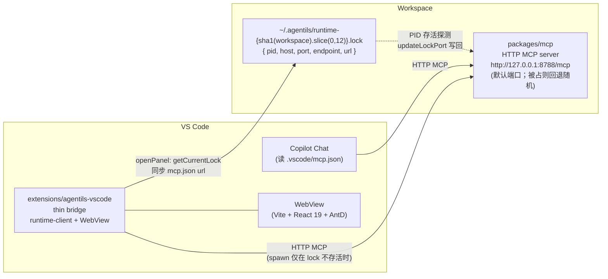

# 01 — Plan C 部署拓扑

每工作区 **只有一个** 运行中的 MCP HTTP server；Copilot 与扩展同时连接它。

## 要点

- **单 server**：第二次启动 MCP 时若发现 lock 指向存活进程，直接退出，避免双 server。
- **共享真值**：Copilot 与扩展看到的是同一份 `state://*`、同一份 task。
- **mcp.json url 自动同步**：默认写 `http://127.0.0.1:8788/mcp`；如果实际绑定到回退端口，扩展在 `openPanel` 时改写 mcp.json。
- **EADDRINUSE 收敛**：`pickFreePort` 之后 `app.listen` 仍可能被抢；transports 层 catch EADDRINUSE → port=0 → `updateLockPort()` 写回真实端口。
