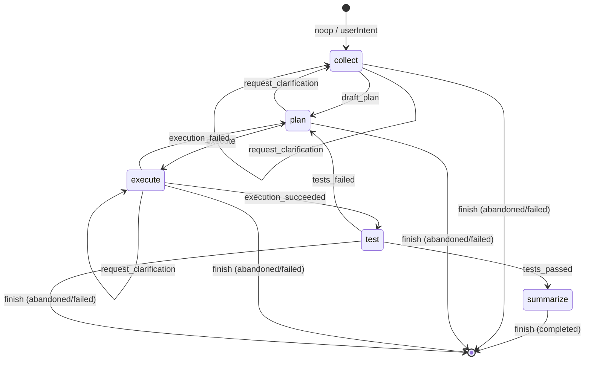

# 02 — V1 任务状态机

`taskPhases = collect | plan | execute | test | summarize`
终态：`active | completed | failed | abandoned`

## directive 与 phase 转移对应

| 当前 phase | directive | 转移 |
|-----------|-----------|------|
| collect | `request_clarification` | 留在 collect，发起 elicitation |
| collect | `draft_plan` | → plan |
| plan | `execute` | → execute |
| plan | `request_clarification` | 留在 plan，发起 elicitation |
| execute | `execution_succeeded` | → test |
| execute | `execution_failed` | → plan（重新规划） |
| execute | `request_clarification` | 留在 execute，发起 elicitation |
| test | `tests_passed` | → summarize |
| test | `tests_failed` | → plan |
| any | `finish` | → terminal（completed/failed/abandoned 由 input 决定） |
| any | `noop` | 不变更，仅返回快照 |

实际转移逻辑见 `packages/mcp/src/orchestrator/orchestrator.ts` `runTaskLoop`。
