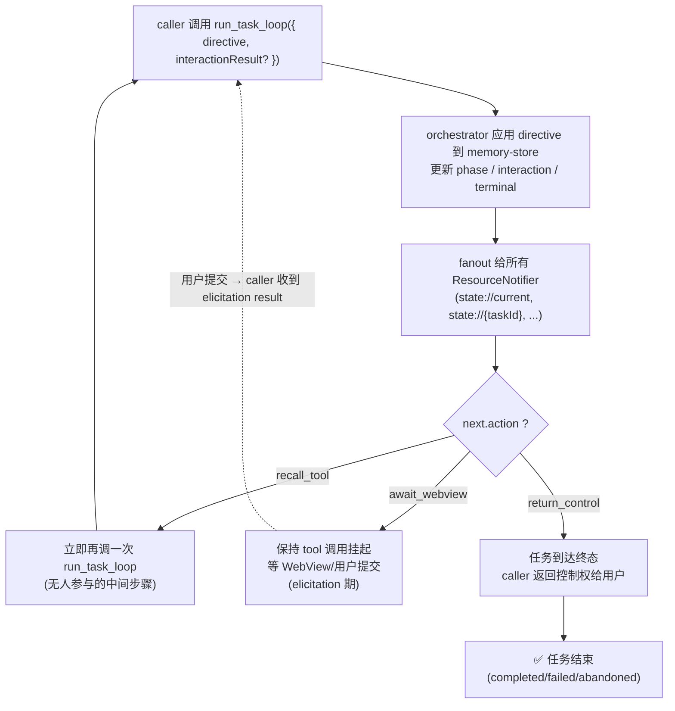

# 03 — `run_task_loop` 决策树

每次 `run_task_loop` 调用返回 `RunTaskLoopResult`，其中 `next.action` 决定 caller 怎么继续。



## 三种 action 的语义

| action | 语义 | 典型出现 |
|--------|------|---------|
| `recall_tool` | 中间状态没有人类阻塞，立即推进下一步 | `noop` 后还有未消化的 directive、`draft_plan` 完成接 `execute` |
| `await_webview` | 触发了 `request_clarification`，等用户回 elicitation | collect/plan/execute 中需要澄清 |
| `return_control` | task terminal | `finish` 或者其它逻辑导致 terminal |

## caller 的标准应对

```ts
let result = await runTaskLoop(initial)
while (result.next.action === 'recall_tool') {
  result = await runTaskLoop({ taskId: result.task.taskId })
}
if (result.next.action === 'await_webview') {
  // 等用户提交
} else if (result.next.action === 'return_control') {
  // 任务结束，呈现 summary
}
```

实际 caller 实现见 `extensions/agentils-vscode/src/runtime-client.ts` 与 `webview-host.ts` 联动。
