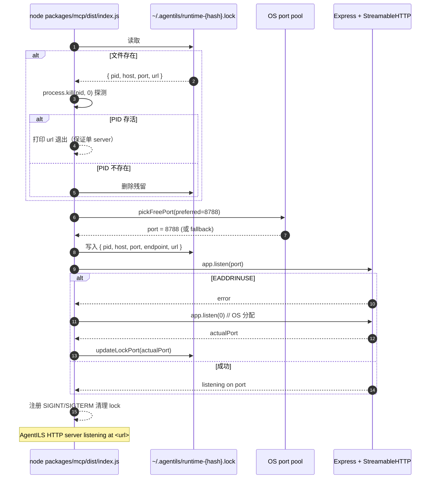

# 04 — HTTP MCP 启动 + lock 协调

## 关键文件

- `packages/mcp/src/runtime/lock.ts` — `acquireRuntimeLock` / `pickFreePort` / `updateLockPort`
- `packages/mcp/src/gateway/transports.ts` — `startStreamableHttpServer` / `startIfEntrypoint` / EADDRINUSE 回退
- `packages/mcp/src/index.ts` — 入口，分流 `--stdio` 与 HTTP

## 为什么要回退 + 改写 lock

`pickFreePort` 与 `app.listen` 之间存在短窗口被其它进程抢占（TOCTOU）。回退到 `port=0`（OS 分配）保证 listen 必成功；之后用真实端口改写 lock，让扩展 / Copilot 能读到正确 url。

## 客户端如何找到正确 url

- Copilot：读 `.vscode/mcp.json`（CLI 写入的默认值或扩展同步过的真实值）
- 扩展：调 `runtimeClient.getCurrentLock()` → 读 lock 文件 → 必要时 `syncMcpJsonUrl()` 更新 mcp.json
