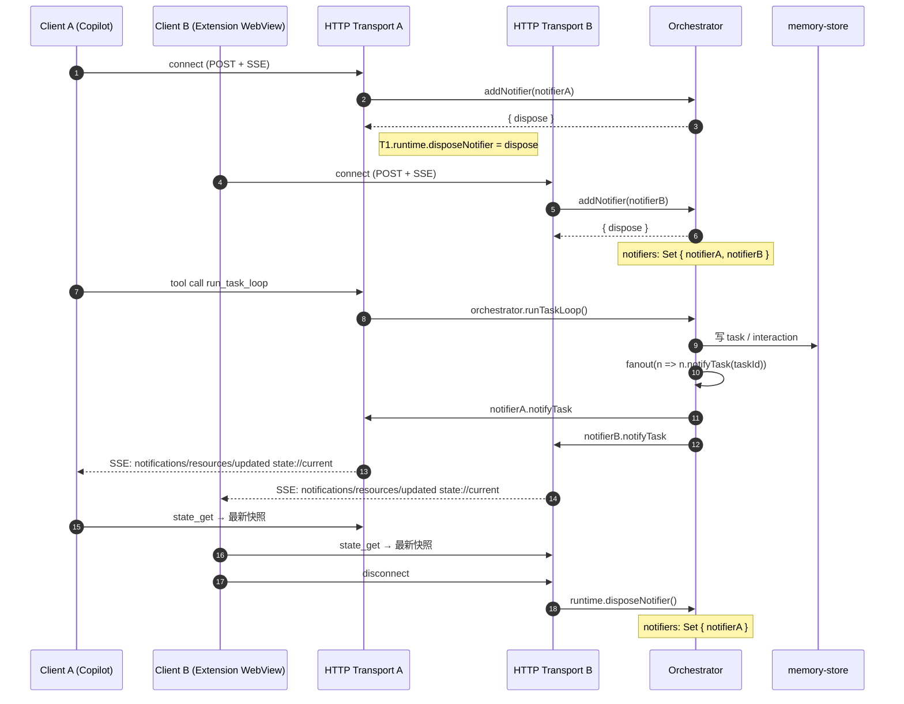

# 05 — ResourceNotifier per-client 推送

每个 HTTP client 连接独立注册 `ResourceNotifier` 到 `orchestrator.notifiers: Set`，断开自动 dispose。

## 关键代码

- `packages/mcp/src/gateway/server.ts` — 创建 runtime + 注册 notifier
- `packages/mcp/src/orchestrator/orchestrator.ts`
  - `addNotifier(notifier): { dispose }`
  - `private fanout(fn)` — 遍历 notifiers 执行
- `packages/mcp/src/gateway/transports.ts` — `transport.onclose` → `runtime.disposeNotifier`

## 与旧 `setNotifier()` 的差异

旧 V1 之前用单值字段 `runtime.notifier`，多客户端会互相覆盖（最后连接的赢）。**新代码必须用 `addNotifier()`**；`setNotifier()` 仅向后兼容，文档不应再演示。
