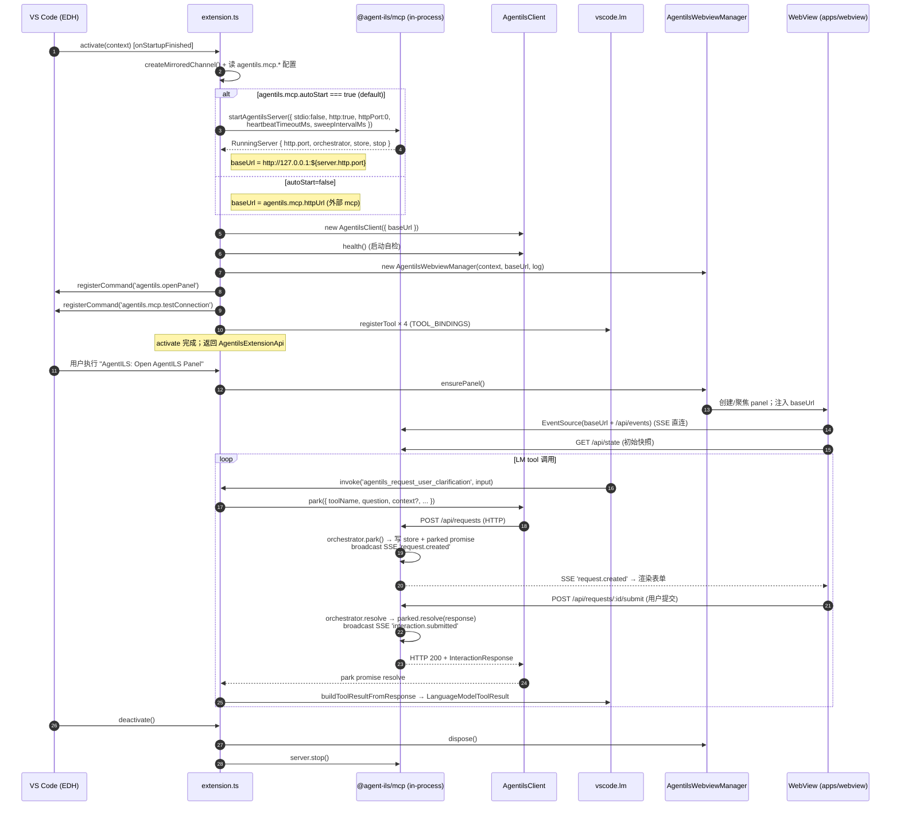

# 06 — VS Code 扩展激活流程（V1 in-process）

## 文件对照（V1 真值）

- `packages/extensions/agentils-vscode/src/extension.ts` — `activate` / `deactivate`、in-process 启 mcp、注册 2 命令 + 4 LM tool、导出 `AgentilsExtensionApi`
- `packages/extensions/agentils-vscode/src/tools/registerTools.ts` — `TOOL_BINDINGS`（4 个 `lmId ↔ ToolName`）+ `vscode.lm.registerTool`
- `packages/extensions/agentils-vscode/src/tools/toolResult.ts` — `buildToolResultFromResponse` / `buildCancelledToolResult`（HTTP 409）/ `buildHeartbeatTimeoutToolResult`（HTTP 408）
- `packages/extensions/agentils-vscode/src/webview/manager.ts` — `AgentilsWebviewManager.ensurePanel()`：单 panel 复用、注入 `baseUrl`
- `packages/extensions/agentils-vscode/src/webview/protocol.ts` — host ↔ webview 消息类型，与 `apps/webview/src/protocol.ts` mirror
- `packages/mcp/src/index.ts` — `startAgentilsServer({ stdio?, http?, httpPort?, ... })` 返回 `RunningServer`
- `packages/mcp/src/transport/http.ts` — `POST /api/requests` / `POST /api/requests/:id/submit` / `GET /api/state` / `GET /api/events` (SSE)
- `packages/mcp/src/orchestrator/orchestrator.ts` — parked promise map + subscribers Set + `sweepExpired`

## V0 → V1 迁移要点

V1 不再有以下机制（出现在旧版 06 流程图里的概念全部已删）：

- `~/.agentils/runtime-*.lock` 文件协议、`acquireRuntimeLock` / `pickFreePort` / `updateLockPort`
- `runtime-client.ts` / `webview-host.ts` / `chat-participant.ts` / `mcp-elicitation-bridge.ts` / `task-service-client.ts`
- `installPromptPack` / `syncMcpJsonUrl` 命令 + `.vscode/mcp.json` 自动改写
- `state://*` MCP resource 订阅 / `subscribeResource` / `onResourceUpdate`
- spawn `node packages/mcp/dist/index.js` 子进程

V1 改用 `httpPort:0` 让 OS 分配端口 + extension 进程内 `import { startAgentilsServer }`，每个 extension host 独立 in-process mcp 实例。Copilot 通过 `.vscode/mcp.json` stdio 条目（由 `packages/cli init` 注入）拉起的子进程是**另一份** mcp（双 transport 同包），与扩展 in-process 的 mcp 共享同一份 `packages/mcp` 代码但是不同进程。
