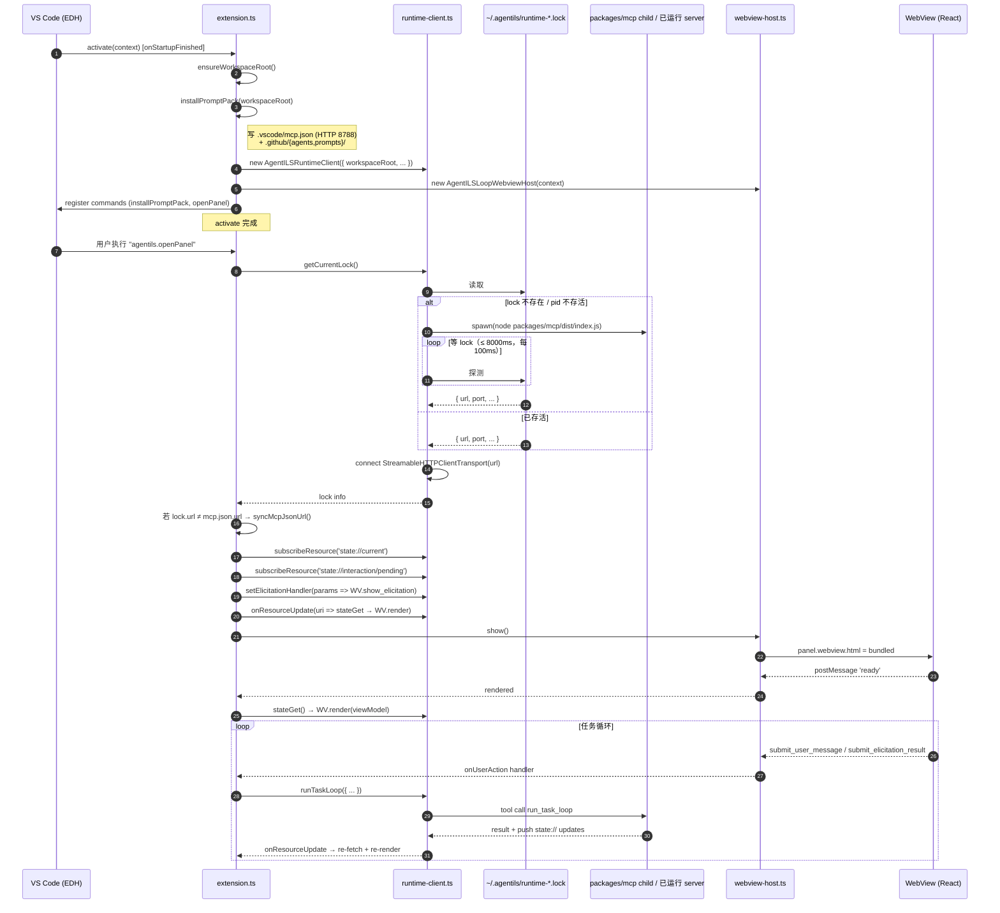

# 06 — VS Code 扩展激活流程

## 文件对照

- `extensions/agentils-vscode/src/extension.ts` — activate / installPromptPack / syncMcpJsonUrl / commands
- `extensions/agentils-vscode/src/runtime-client.ts` — lock 查找 + spawn + HTTP MCP 连接 + close 兜底
- `extensions/agentils-vscode/src/webview-host.ts` — WebViewPanel 生命周期 + pendingResolver + onUserAction
- `extensions/agentils-vscode/src/webview-protocol.ts` — host ↔ webview 协议
- `extensions/agentils-vscode/webview/` — 独立 Vite + React 子工程

## 已废除的旧组件（V1 不应重新引入）

- `chat-participant.ts` / `session/` / `interaction-channel/` / `lm-tools/`
- `mcp-elicitation-bridge.ts`（独立 stdio 子进程桥）
- `task-service-client.ts` / `task-console-panel.ts` / `panel/`
