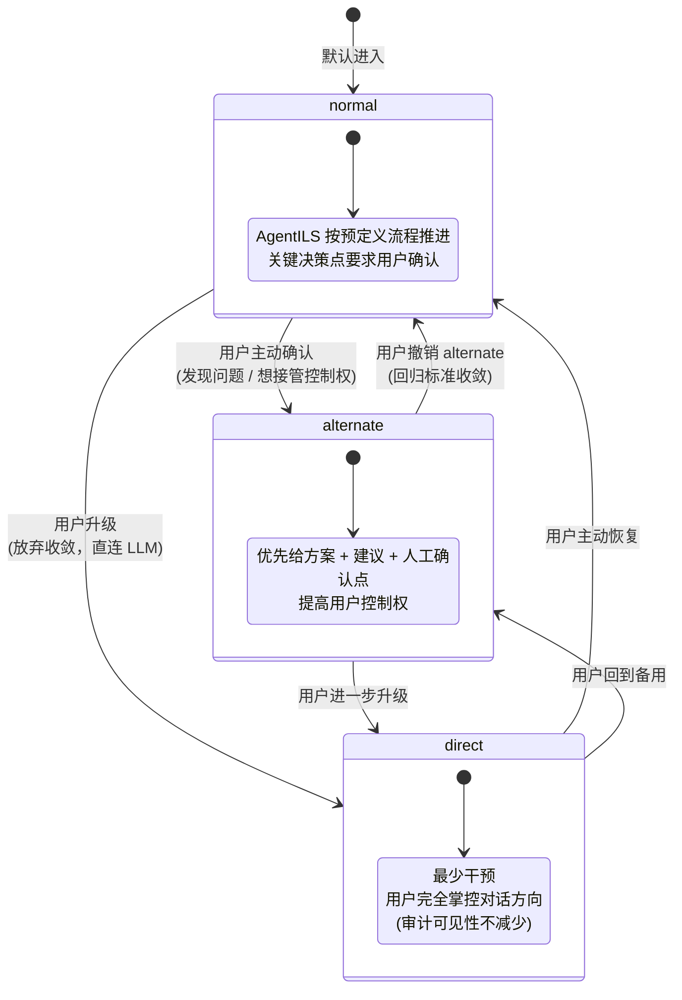

# 07 — 三种执行法则切换

`ControlMode = 'normal' | 'alternate' | 'direct'`，每个 task 当前模式可经 `state://controlMode/{taskId}` 实时查看。

## 与航空 ILS 的隐喻

- **正常法则 (normal)**：标准 ILS 进近，按预定路径下降到决断高度
- **备用法则 (alternate)**：转入备用程序，飞行员有更多裁量权
- **直接法则 (direct)**：放弃 ILS 引导，目视进近 / 飞行员直接操控

## 不变量

- 所有模式下 **审计可见性** 一致：state://timeline、interaction、override 都仍可读
- 模式只影响 AgentILS 自动收敛的强度，不影响数据流方向（仍单向：gateway → orchestrator → store → 投影）
- 命名常量永远是 `'normal'` / `'alternate'` / `'direct'`，不写成 `Normal` / `ALT` 等变体

## 实现位置

- `packages/mcp/src/types/control-mode.ts` — `ControlMode` 类型与 `OverrideState`
- `packages/mcp/src/orchestrator/control-mode-orchestrator.ts` — 模式转换 + 事件写入
- `packages/mcp/src/gateway/resources.ts` — `state://controlMode/{taskId}` 投影
